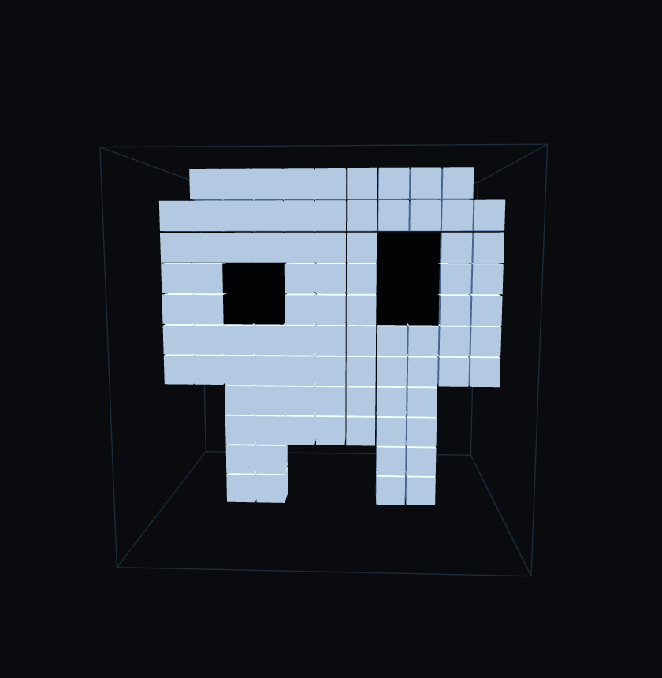

# Project 2 - Skull
-------------------------

  

-------------------------

<table align="center">
  <tr>
    <th>Dimensiones</th>
    <th>Code Size</th>
    <th>Cycles/Voxels</th>
  </tr>
  <tr>
    <td align="center">11x11x11</td>
    <td align="center"></td>
    <td align="center"></td>
  </tr>
</table>

--------------------------

<table align="center">
  <tr>
    <th>Code</th>
  </tr>
  <tr>
    <td align="center">
      <a href="code.lua">💾</a>
    </td>
  </tr>
